# DAN (Deep Affinity Network)

## Table Of Content

   * [DAN (Deep Affinity Network)](#dan-deep-affinity-network)
      * [Table Of Content](#table-of-content)
      * [Purpose](#purpose)
      * [Deep Affinity Network (DAN)](#deep-affinity-network-dan)
         * [The input &amp; output of network](#the-input--output-of-network)
            * [Training phase](#training-phase)
            * [Testing phase](#testing-phase)
      * [Task](#task)
         * [Current Task](#current-task)
         * [History Task](#history-task)
      * [Requirement](#requirement)
      * [Dataset](#dataset)
      * [Train &amp; Test On MOT17](#train--test-on-mot17)
         * [Download dataset](#download-dataset)
         * [Test](#test)
         * [Train](#train)
      * [Citation](#citation)
      * [Acknowledge](#acknowledge)
      * [License](#license)
      * [Cool Examples](#cool-examples)

## Purpose

DAN is an end-to-end deep learning network during train phase, whose purpose is to extract the predetected objects' feature and performs pairing permutations of those features in any two frames to infer object affinities. Besides, DAN also accounts for multiple objects appearing and disappearing between video frames.

> Note: The repository was built with the name "SST". For the brevity and easy understanding, we change the repository name by "DAN".


## Deep Affinity Network (DAN)

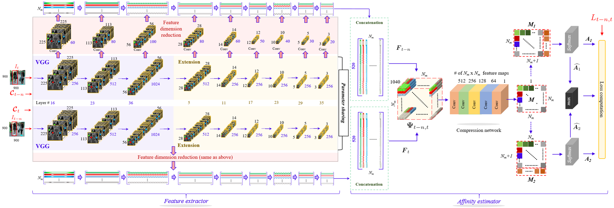

> The network can be divided into two parts: feature extractor and affinity extractor. The feature extractor extracts each detected objects' features. The affinity extractor leverage those features to compute object data association matrix.

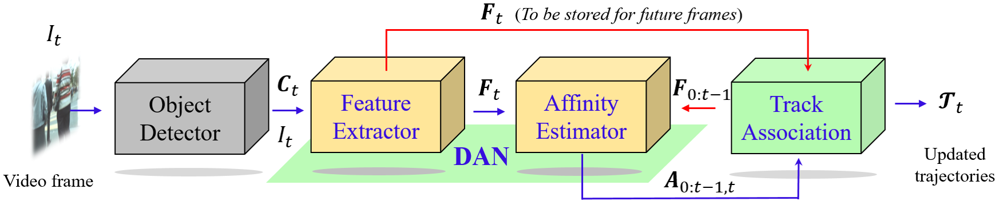

> Deep tracking with DAN deployment. The **DAN** extracts the feature of each detected object provided by the *Detector*, and also estimate the affinity matrices.

### The input & output of network

#### Training phase

| Name   | Items                                                        |
| ------ | ------------------------------------------------------------ |
| Input  | - Two video frames (with any interval frame)<br/>- Center of the pre-detected boxes <br>- Binary data association matrix |
| Output | - Loss                                                       |

#### Testing phase

| Name   | Items                                                        |
| ------ | ------------------------------------------------------------ |
| Input  | - Two video frames (with any interval frame)<br/>- Center of the pre-detected boxes |
| Output | - Features of pre-detected boxes <br/>- Predicted matrices used to compute object affinities |


## Task

### Current Task

| Title                    | Start      | Due  | Detail                            | Status     |
| ------------------------ | ---------- | ---- | --------------------------------- | ---------- |
| Update the result of DPM | 2018/10/31 | -    | Update the result of DPM of MOT17 | Continuing |

### History Task

| Title                   | Start      | Due        | Detail                             | Status    |
| ----------------------- | ---------- | ---------- | ---------------------------------- | --------- |
| Update ReadMe           | 2018/10/28 | 2018/10/31 | Update the README according paper  | Finish    |
| Evaluate MOT15          | 2018/09/15 | 2018/10/20 | Evaluate on MOT15                  | Finish    |
| Re-evaluate MOT17       | 2018/08/10 | 2018/09/01 | Re-evaluate on MOT17               | Finish    |
| Fix Result of UA-DETRAC | 2018/08/01 | 2018/09/13 | Fix the result of UA-DETRAC        | Finish    |
| Start UA-DETRAC         | 2018/04/23 | 2018/09/13 | Evaluate on UA-DETRAC              | Finish    |
| KITTI                   | 2018/04/11 | 2018/04/23 | Training, Optimize                 | Give up:( |
| Re-Train KITTI          | 2018/04/18 | 2018/04/20 | with gap frame 5                   | Finish    |
| Continue Train KITTI    | 2018/04/16 | 2018/04/18 | Continue training KITTI            | Finish    |
| Training KITTI dataset  | 2018/04/11 | 2018/04/16 | Training KITTI dataset             | Finish    |
| Evaluate On MOT17       | 2018/02    | 2018/03/28 | Top 1 at MOT17 :)                  | Finish    |
| Design Framework        | 2017/11/15 | 2018/01/14 | The tracking framework             | Finish    |
| Select Dataset          | 2017/11/10 | 2017/11/15 | MOT17, KITTI, UA-DETRAC            | Finish    |
| Designing network       | 2017/10/15 | 2017/11/15 | Designing the network for training | Finish    |
| Start the project       | 2017/10/01 | 2017/10/15 | Start the idea based on SSD        | Finish    |

## Requirement
The requirement as follows:

| Name    | Version |
| ------- | ------- |
| cuda    | 8.0     |
| python  | 3.5     |
| pytorch | 0.3.1   |


> Before going on, we recommend *minconda*. After you install miniconda, then create a new environment named **DAN**, then run the following script:
>
> ```shell
> conda create -n DAN python=3.5
> source activate DAN
> ```

Run the following script to install the required python packages:

> If you're in China, you'd better run the following script in order to speed up the downloading.
>
> ```shell
> pip install pip -U
> pip config set global.index-url https://pypi.tuna.tsinghua.edu.cn/simple
> ```

```shell
cd SST
pip install -r requirement.txt
```

> SST is the path of our repository folder.

## Dataset

Our method can be evaluated on [MOT17](https://motchallenge.net/data/MOT17/), [MOT15](https://motchallenge.net/data/MOT15/) and [UA-DETRAC](https://detrac-db.rit.albany.edu/). 

> MOT15 and MOT17 is for pedestrian tracking.
>
> UA-DETRAC focuses is for vehicle tracking.

## Train & Test On MOT17

> For the simplity, we only introduce how to train and evaluate on MOT17


### Download dataset

1. Download the [mot 17 dataset 5.5 GB](https://motchallenge.net/data/MOT17.zip) and [development kit 0.5 MB](https://motchallenge.net/data/devkit.zip).

2. Unzip this the dataset. Here is my file structure.

   ```shell
   MOT17
   ├── test
   └── train
   ```

### Test

1. Download the weigths from [*Dropbox*](https://www.dropbox.com/s/cvtuhegqy004u57/sst300_0712_83000.pth?dl=0) or [BaiYunPan](https://pan.baidu.com/s/1Z5fhriuAqhqIjlY7ZI6qVg) to the **SST/weights** folder

2. Modify **SST/config/config.py** as follows:

   ```python
   # You need to modify line 8, 72, 73 and 74.
   8	current_select_configure = 'init_test_mot17' # need use 'init_test_mot17'
   ...	...
   70	def init_test_mot17():
   71        config['resume'] = './weights/sst300_0712_83000.pth'
   72        config['mot_root'] = 'replace by your dataset folder' 
   73		  config['save_folder'] = 'replace by your save folder'
   74        config['log_folder'] = 'replace by your log folder'
   75        config['batch_size'] = 1
   76        config['write_file'] = True
   77        config['tensorboard'] = True
   78        config['save_combine'] = False
   79        config['type'] = 'test' # or 'train'
   ```

3. run *test_mot17.py*

   ```shell
   cd <SST>
   python test_mot17.py
   ```

   The result is shown as follows

   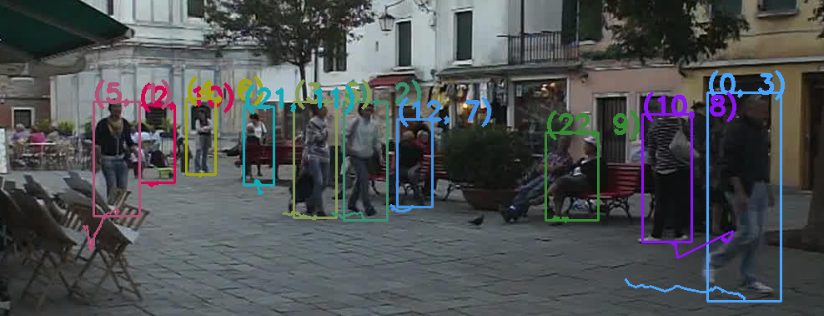

   > The title of each detected boxes represents (track id, detection id)

### Train

1. Download the vgg weights from [*Dropbox*](https://www.dropbox.com/s/vhk55xmiauicmjk/vgg16_reducedfc.pth?dl=0) or [BaiYunPan](https://pan.baidu.com/s/1RRubs2zEQUUYixJQmNW68Q) to the weights folder

2. Modify **SST/config/config.py** as follows:

   ```python
   # you need to modify line 8, 87, 89, 90 and 91.
   8	current_select_configure = 'init_train_mot17' # need use 'init_train_mot17'
   ...	...
   85	def init_train_mot17():
   86		config['epoch_size'] = 664
   87		config['mot_root'] = 'replace by your mot17 dataset folder'
   88		config['base_net_folder'] = './weights/vgg16_reducedfc.pth'
   89		config['log_folder'] = 'replace by your log folder'
   90		config['save_folder'] = 'replace by your save folder'
   91		config['save_images_folder'] = 'replace by your image save folder'
   92		config['type'] = 'train'
   93		config['resume'] = None # None means training from sketch.
   94		config['detector'] = 'DPM'
   95		config['start_iter'] = 0
   96		config['iteration_epoch_num'] = 120
   97		config['iterations'] = config['start_iter'] + config['epoch_size'] *     config['iteration_epoch_num'] + 50
   98		config['batch_size'] = 4
   99		config['learning_rate'] = 1e-2
   100		config['learning_rate_decay_by_epoch'] = (50, 80, 100, 110)
   101		config['save_weight_every_epoch_num'] = 5
   102		config['min_gap_frame'] = 0
   103		config['max_gap_frame'] = 30
   104		config['false_constant'] = 10
   105		config['num_workers'] = 16
   106		config['cuda'] = True
   107		config['max_object'] = 80
   108		config['min_visibility'] = 0.3
   ```

3. Run *train_mot17.py*

   ```shell
   cd <SST>
   python train_mot17.py
   ```


## Citation

If you use this source code or part of the source code. It is necessary to  cite the following paper:

> Sun. S., Akhtar, N., Song, H.,  Mian A., & Shah M. (2018). Deep Affinity Network for Multiple Object Tracking, Retrieved from [https://arxiv.org/abs/1810.11780](https://arxiv.org/abs/1810.11780)


## Acknowledge

This code is based on [**ssd.pytorch**](https://github.com/amdegroot/ssd.pytorch)


## License

>  The methods provided on this page are published under the [Creative Commons Attribution-NonCommercial-ShareAlike 3.0 License](http://creativecommons.org/licenses/by-nc-sa/3.0/) . This means that you must attribute the work in the manner specified by the authors, you may not use this work for commercial purposes and if you alter, transform, or build upon this work, you may distribute the resulting work only under the same license. If you are interested in commercial usage you can contact us for further options.


## Cool Examples

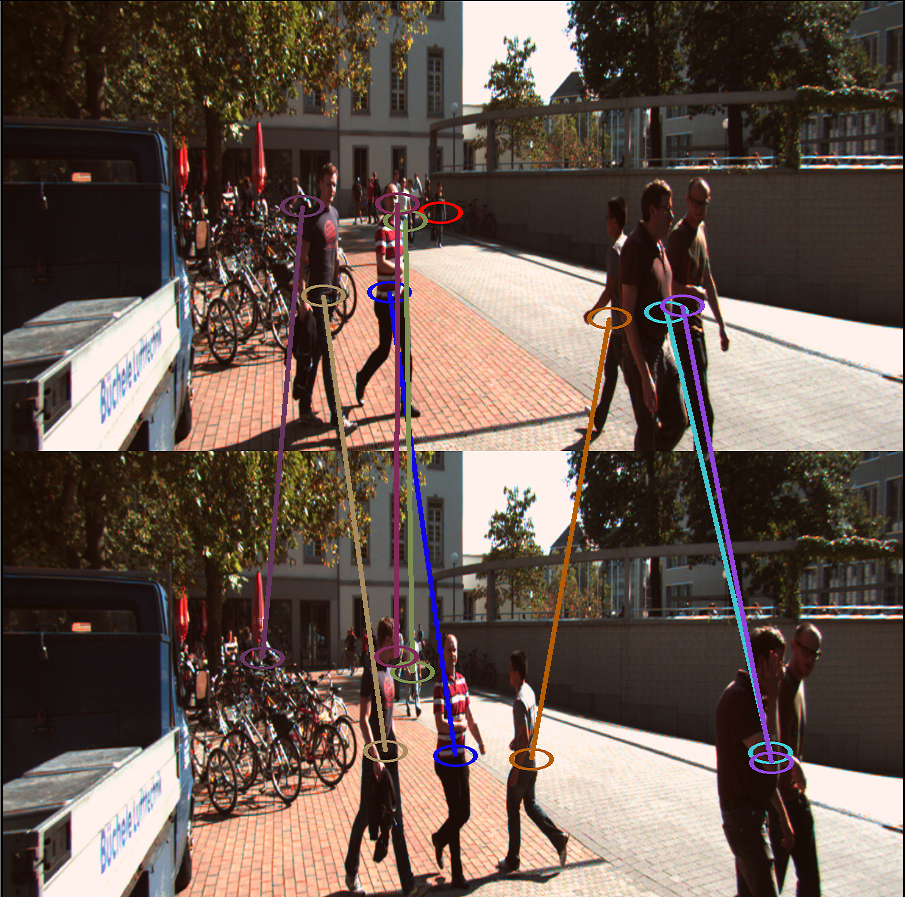

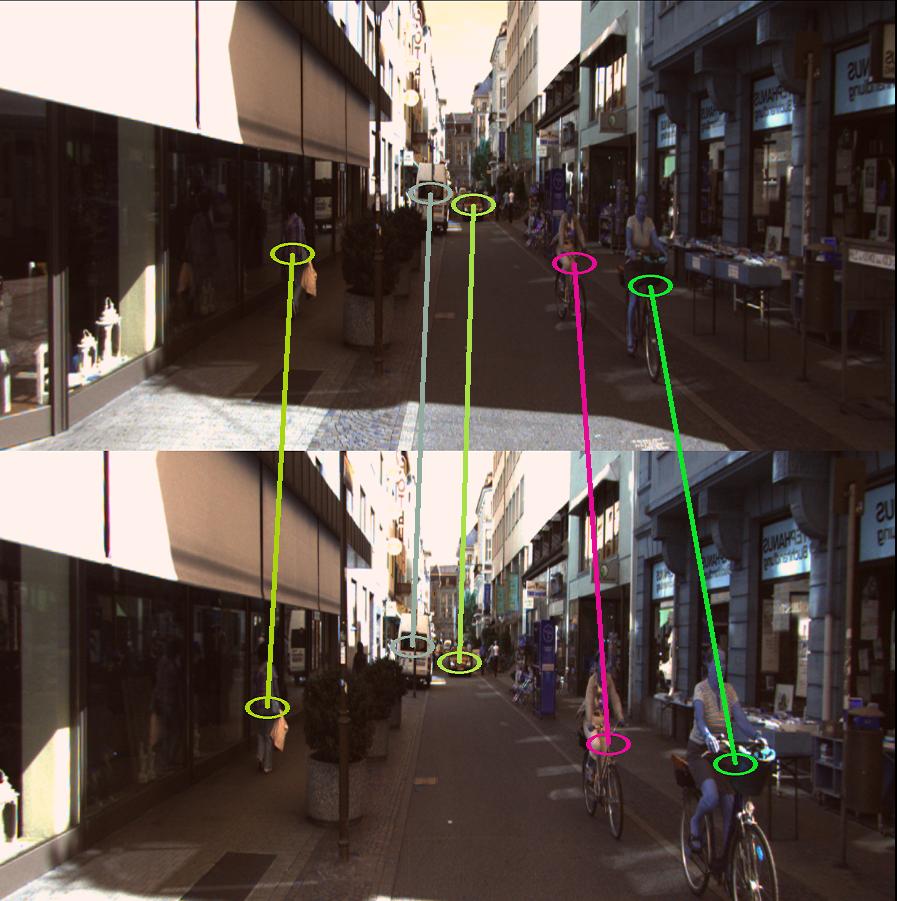

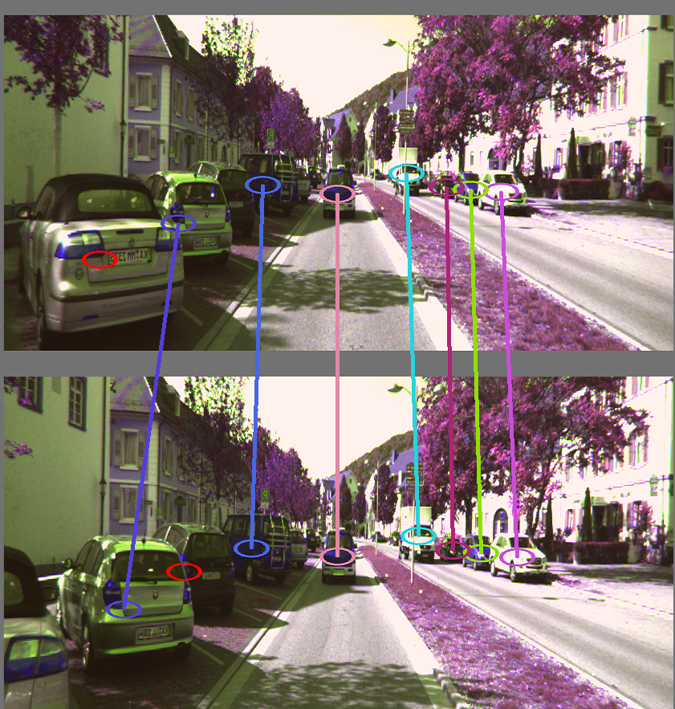

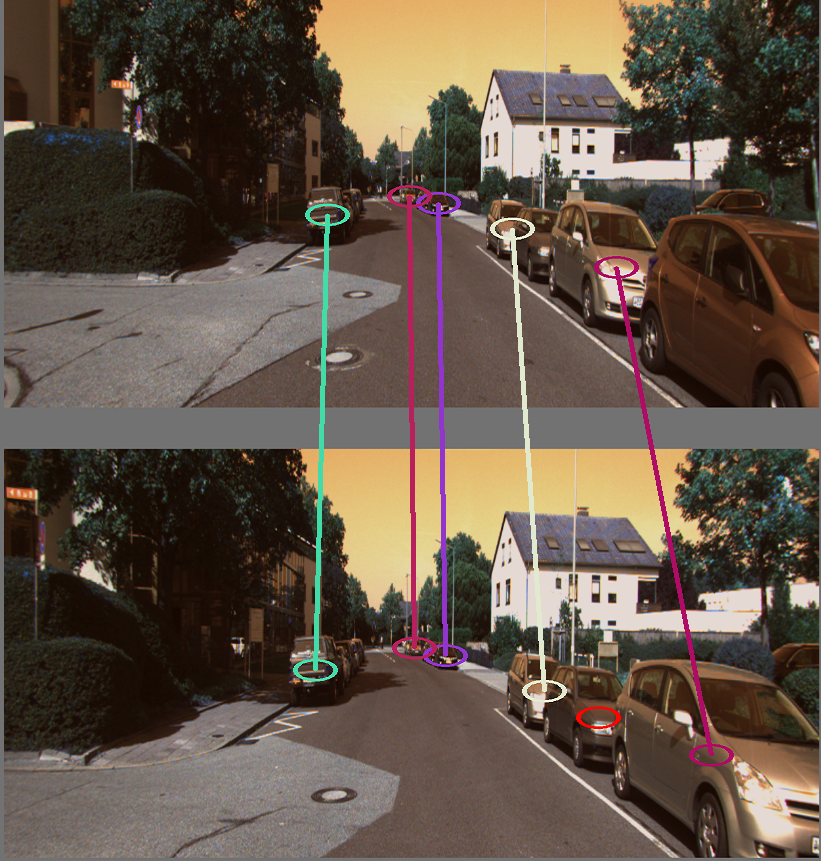

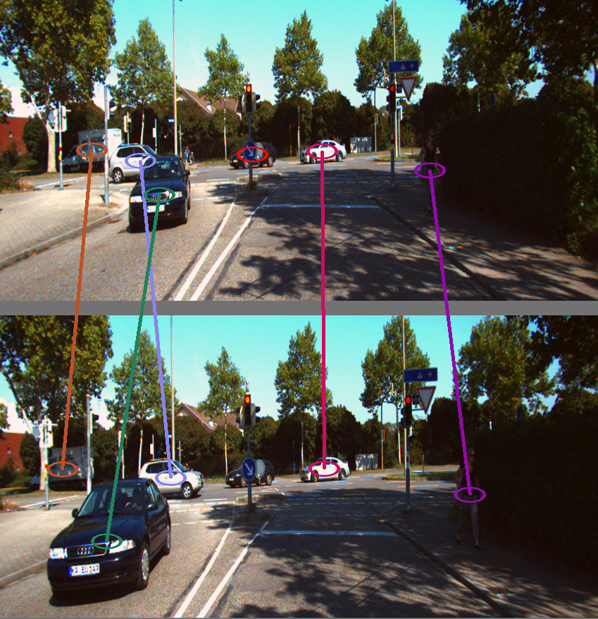


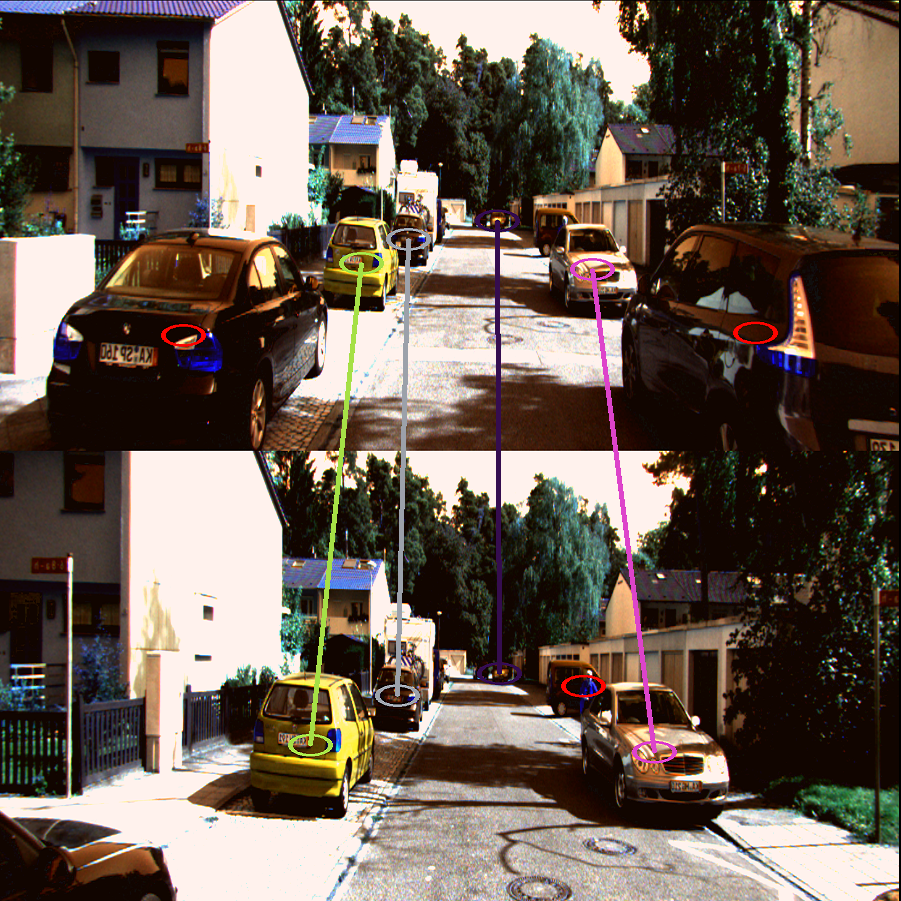

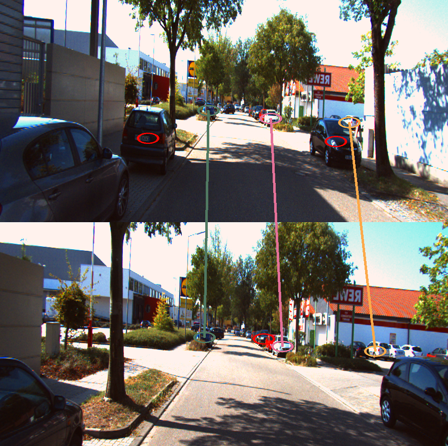

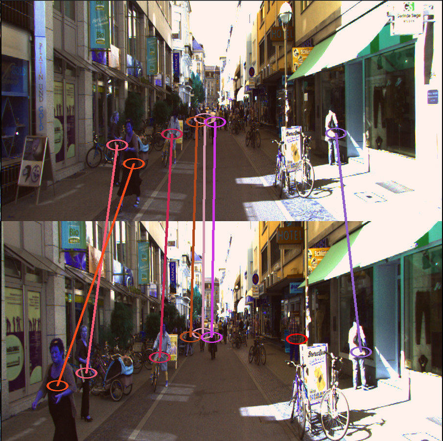

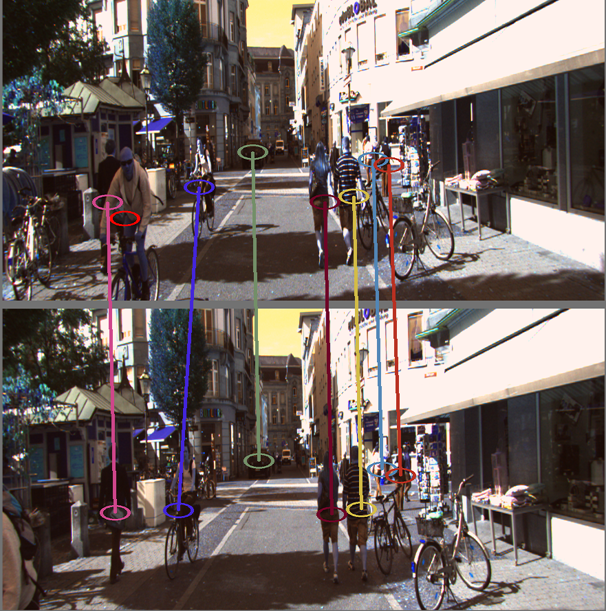

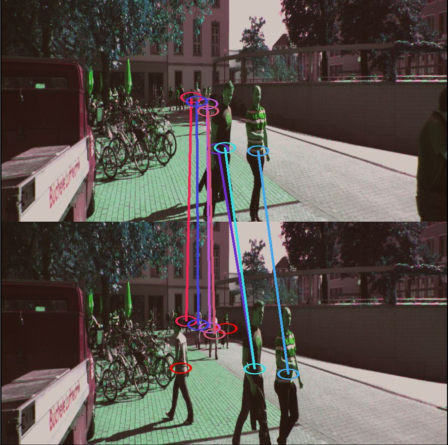

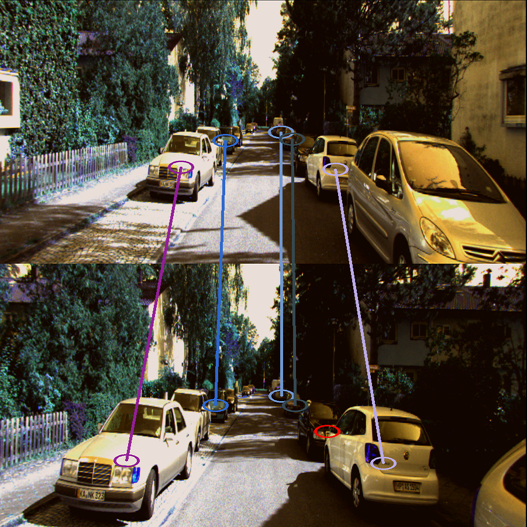

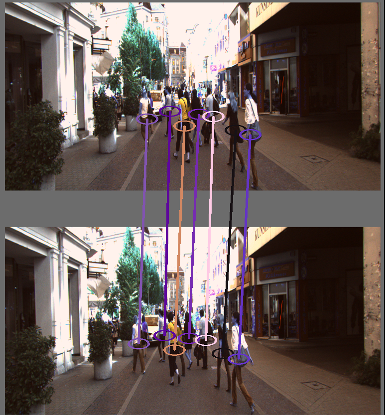

