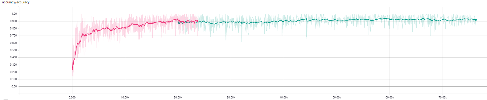
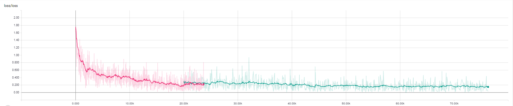

# DAN (Deep Affinity Network)

> readme.md is still building now.

## Purpose
DAN is an end-to-end deep learning network during train phase, whose purpose is to extract the predetected objects' feature and performs pairing permutations of those features in any two frames to infer object affinities. Besides, DAN also accounts for multiple objects appearing and disappearing between video frames.

> Note: The repository was built with the name "SST". For the brevity and easy understanding, we change the repository name by "DAN".


## Schematics of Deep Affinity Network (DAN)


> The network can be divided into two parts: The feature extractor and Affinity extractor. The feature extractor extracts each detected objects' feature. The affinity extractor leverage the those features to compute object data association matrix.

### The input & output of network

#### Training phase

| Name   | Items                                                        |
| ------ | ------------------------------------------------------------ |
| Input  | - Two video frames (with any interval frame)<br/>- Center of the pre-detected boxes <br>- Binary data association matrix |
| Output | - Loss                                                       |

#### Testing phase

| Name   | Items                                                        |
| ------ | ------------------------------------------------------------ |
| Input  | - Two video frames (with any interval frame)<br/>- Center of the pre-detected boxes |
| Output | - Features of pre-detected boxes <br/>- Predicted matrices used to compute object affinities |


## Task

### Current Task

| Title         | Start      | Due  | Detail                            | Status     |
| ------------- | ---------- | ---- | --------------------------------- | ---------- |
| Update ReadMe | 2018/10/28 | -    | Update the README according paper | Continuing |

### History Task

| Title                   | Start      | Due        | Detail                             | Status    |
| ----------------------- | ---------- | ---------- | ---------------------------------- | --------- |
| Evaluate MOT15          | 2018/09/15 | 2018/10/20 | Evaluate on MOT15                  | Finish    |
| Re-evaluate MOT17       | 2018/08/10 | 2018/09/01 | Re-evaluate on MOT17               | Finish    |
| Fix Result of UA-DETRAC | 2018/08/01 | 2018/09/13 | Fix the result of UA-DETRAC        | Finish    |
| Start UA-DETRAC         | 2018/04/23 | 2018/09/13 | Evaluate on UA-DETRAC              | Finish    |
| KITTI                   | 2018/04/11 | 2018/04/23 | Training, Optimize                 | Give up:( |
| Re-Train KITTI          | 2018/04/18 | 2018/04/20 | with gap frame 5                   | Finish    |
| Continue Train KITTI    | 2018/04/16 | 2018/04/18 | Continue training KITTI            | Finish    |
| Training KITTI dataset  | 2018/04/11 | 2018/04/16 | Training KITTI dataset             | Finish    |
| Evaluate On MOT17       | 2018/02    | 2018/03/28 | Top 1 at MOT17 :)                  | Finish    |
| Design Framework        | 2017/11/15 | 2018/01/14 | The tracking framework             | Finish    |
| Select Dataset          | 2017/11/10 | 2017/11/15 | MOT17, KITTI, UA-DETRAC            | Finish    |
| Designing network       | 2017/10/15 | 2017/11/15 | Designing the network for training | Finish    |
| Start the project       | 2017/10/01 | 2017/10/15 | Start the idea based on SSD        | Finish    |

## Requirement
The requirement as follows:

| Name    | Version |
| ------- | ------- |
| cuda    | 8.0     |
| python  | 3.5     |
| pytorch | 0.3.1   |


> Before going on, we recommend *minconda*. After you install miniconda, then create a new environment named **DAN**, then run the following script:
>
> ```shell
> conda create -n DAN python=3.5
> source activate DAN
> ```

Run the following script to install the required python packages:

```shell
pip install -r requirement.txt
```

## Dataset

Our method is evaluated on [MOT17](https://motchallenge.net/data/MOT17/), [MOT15](https://motchallenge.net/data/MOT15/) and [UA-DETRAC](https://detrac-db.rit.albany.edu/). 

> MOT15 and MOT17 is for pedestrian tracking.
>
> UA-DETRAC focuses is for vehicle tracking.


## Train & Test On MOT17

> For the simplity, we only introduce how to train and evaluate on MOT17


### Download dataset

1. Download the [mot 17 dataset 5.5 GB](https://motchallenge.net/data/MOT17.zip) and [development kit 0.5 MB](https://motchallenge.net/data/devkit.zip).
2. Unzip this the dataset. Its folder is denoted as <MOT17_ROOT>.


======**Stop Here**======

### UA-DETRAC

1. Download all the package in the [official set](http://detrac-db.rit.albany.edu/download) into a folder "ua", which is the root of this dataset.
2. Use "tools/convert_mat_2_ua.py" to convert the DETRAC-Train-Annotations-MAT to the text file

```shell
unzip \*.zip
```

## Testing
### MOT17
- Go to the project folder
- In config/config.py, change the configure in function init_test_mot() and decommend the code as follows:
```python
    init_test_mot()
```
- Run the following command:
```python
PYTHONPATH=. python test_mot.py
```

### UA-DETRAC


### KITTI
- Go to the project folder
- In config/config.py, change the configure in function init_test_kitti() and decommend the code as follows:
```python
    init_test_kitti()
```
- Run the following command:
```python
PYTHONPATH=. python test_kitti.py
```

## Training
We provide a convient way to train the network. Currently, MOT dataset, KITTI dataset is supported.
## MOT
- Go to the root folder of this project
- In config/config.py, change the configure in function init_train_mot() and decomment the code as follows:
 ```python
    init_train_kitti()
 ```
- Run the following command
```python
PYTHONPAHT=. python train_kitti.py
```

## KITTI
- Go to the root folder of this project
- In config/config.py, change the configure in function init_train_kitti() and decomment the code as follows:
 ```python
    init_train_kitti()
 ```
- Run the following command
```python
PYTHONPAHT=. python train_kitti.py
```

## Citation

If you use this source code or part of the source code. It is necessary to  cite the following paper:

> Sun. S., Akhtar, N., Song, H.,  Mian A., & Shah M. (2018). Deep Affinity Network for Multiple Object Tracking, Retrieved from [https://arxiv.org/abs/1810.11780](https://arxiv.org/abs/1810.11780)


## CopyRight

## Some Cool Examples:


<!--# Log-->
<!--## 2018/04/23 Continue Training KITTI-->
<!--The accuracy of training kitti reaches at about 92%-->

<!--|parameter name | value     |-->
<!--|---            |---        |-->
<!--|learning rate  | 0~40k(1e-2), 40k~50k(1e-3), 50k~55k(1e-4), 55k~70k(1e-3), 70k~75k(1e-4), 75k~80k(1e-5)|-->
<!--|max gap        | 5         |-->

<!---->
<!---->

<!--## 2018/04/19 Problems-->
<!--We find that it is a very difficult task when the gap frame is 30. Because, there 10m when the car's speed is 30km/s. What's more, the car has similar appearance, so it's hard to decide whether its a new object or not. As a result, the accuracy of sst net is about 83% shown as follows.-->

<!--|parameter name | value |-->
<!--|---            |---    |-->
<!--|learning rate  |0~35k(5e-3), 35k~45k(5e-4), 45k~50k(5e-5), 50k~65k(5e-6)|-->
<!--|maxmimum gap   |   30  |-->

<!---->
<!---->

<!--In order to solve this problem properly, we adjust the gap frame from 30 to 5.-->


<!--## 2018/04/16 Fix the tensorboard histogram problem-->
<!--We find the problem in showing the histogram of weight, see follows-->

<!---->

<!--We fix this problem by replace the code-->

<!--```python-->
<!--writer.add_histogram(name, param.clone().cpu().data.numpy(), iteration)-->
<!--```-->
<!--by-->

<!--```python-->
<!--writer.add_histogram(name, param.clone().cpu().data.numpy(), iteration, bins='doane')-->
<!--```-->

<!--Besdies, we also fix the issue in kitti.py for reading data.-->

<!--## 2018/04/14 Continue Training KITTI-->
<!--I have tried to continue training the network by the follow paraemter-->

<!--|parameter name|value|-->
<!--|---|---|-->
<!--learning rate | 55k~85k(1e-2), 85k~100k(1e-3)-->
<!--maximum gap | 30-->

<!--But the result is bad.-->
<!---->
<!---->

<!--So I plan to change the "Constant Value" from 10 to 1 and see what happens.-->

<!--## 2018/04/13 Training KITTI-->
<!--we trained the kitti dataset by the following parameters-->

<!--|parameter name| value |-->
<!--|---|---|-->
<!--|learning rate| 0-50k(1e-2), 50k-65k(1e-3)|-->
<!--|maximum gap| 30 |-->

<!--The result and accuracy is shown below:-->
<!---->
<!---->
<!-- we find that if we decrease the learning or keep it as 1e-3, we get get better result.-->

<!-- We also find that it's so hard to matching cars even for human being when the frame gap is 30-->
<!---->
